

# PA4 Submission: TaskFlow Pipeline

## Student Information

| Field | Value |
|---|---|
| Name | Sania Atif |
| Roll Number | 24030009 |
| GitHub Repository URL | https://github.com/saniaatif1597/CS487-PA4 |
| Resource Group | `rg-sp26-24030009` |
| Assigned Region | `ukwest` |

## Evidence Rules

- Use relative image paths, for example: ``.
- Every image must have a 1-3 sentence description below it.
- Azure Portal screenshots must show the resource name and enough page context to identify the service.
- CLI screenshots must show the command and output.
- Mask secrets such as function keys, ACR passwords, and storage connection strings.

---

## Task 1: App Service Web App (15 points)

### Evidence 1.1: Forked Repository

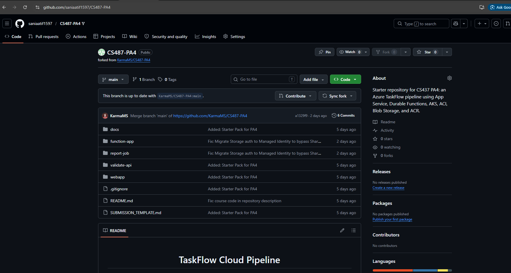

The starter repository has been forked to `saniaatif1597/CS487-PA4`. The fork contains the full PA4 project structure including `webapp/`, `function-app/`, `validate-api/`, and `report-job/` directories as required.

### Evidence 1.2: App Service Overview

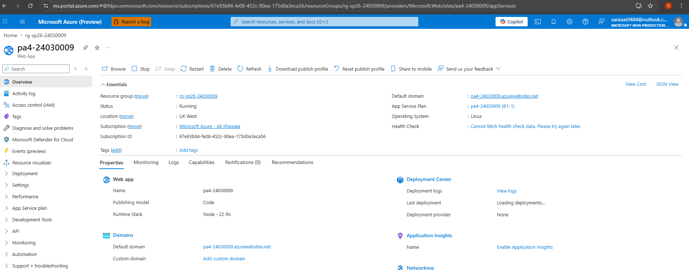

The Web App `pa4-24030009` is deployed in resource group `rg-sp26-24030009` in the UK West region, running on the Node 22 LTS runtime stack with status showing Running. The public URL is `https://pa4-24030009.azurewebsites.net`.

### Evidence 1.3: Deployment Center / GitHub Actions

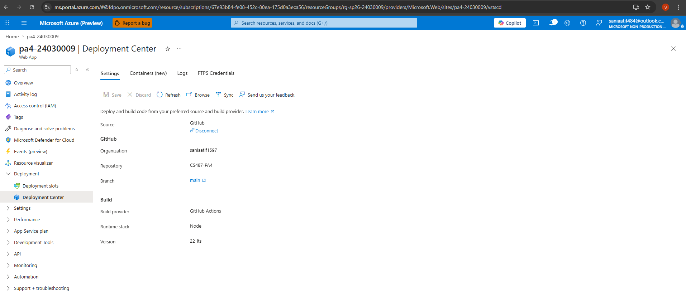

The Deployment Center is configured to deploy from the `main` branch of the forked GitHub repository `saniaatif1597/CS487-PA4`. GitHub Actions handles the CI/CD pipeline automatically on every push.

### Evidence 1.4: Live Web UI

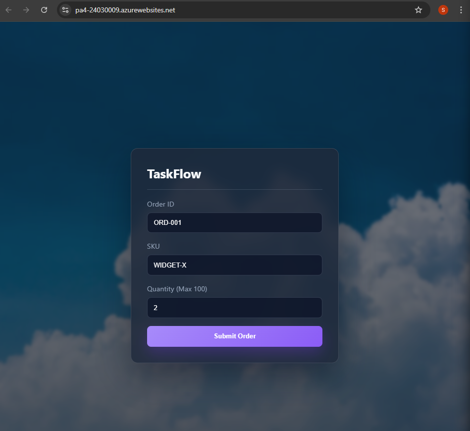

The App Service is successfully serving the TaskFlow frontend at `https://pa4-24030009.azurewebsites.net`. The page displays the order submission form with Order ID, SKU, and Quantity fields.

### Evidence 1.5: Application Settings

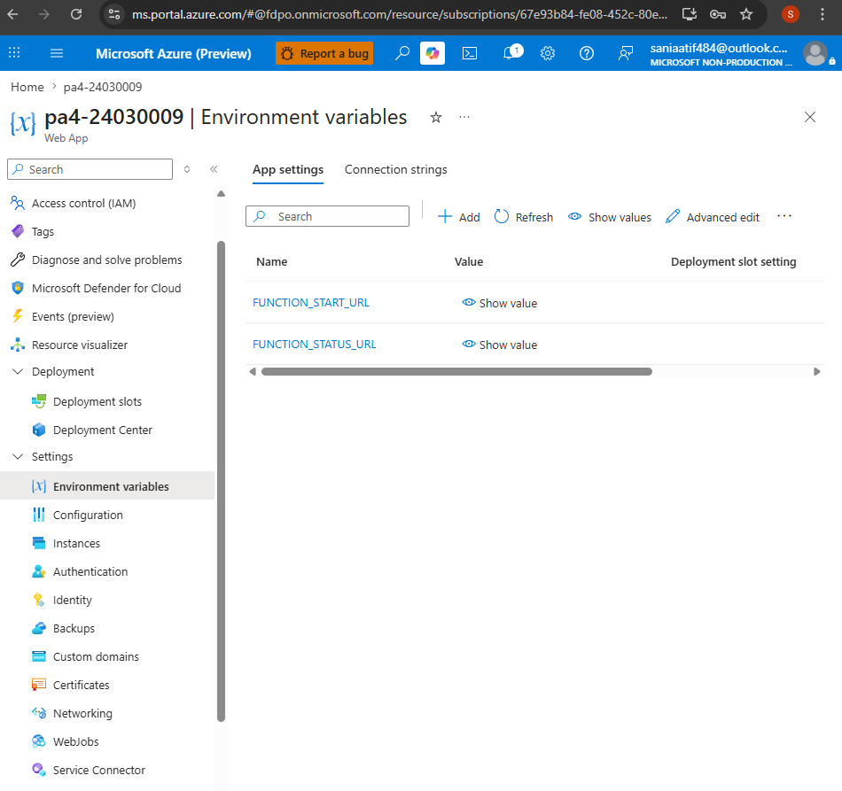

The Web App has `FUNCTION_START_URL` and `FUNCTION_STATUS_URL` configured as application settings, pointing to the Durable Function HTTP starter endpoint and status query prefix respectively.

---

## Task 2: Azure Container Registry (15 points)

### Evidence 2.1: ACR Overview

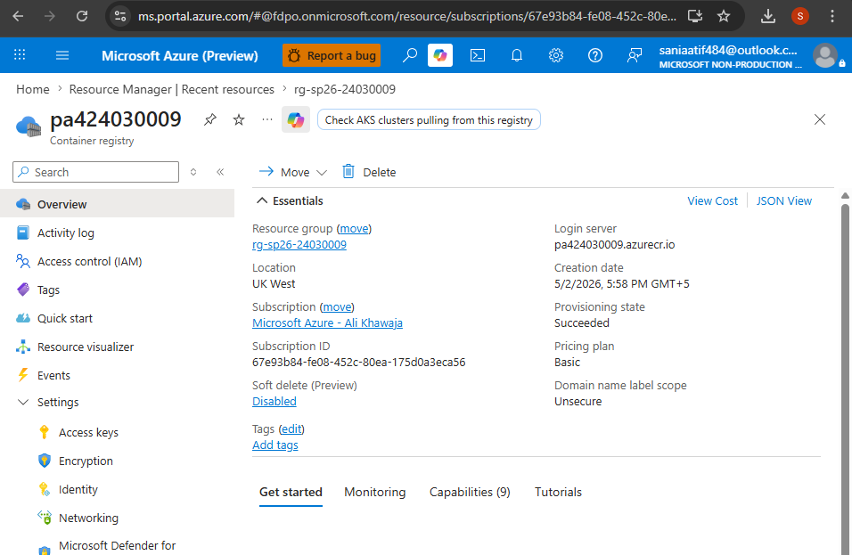

The Azure Container Registry `pa424030009` has been created in resource group `rg-sp26-24030009` in UK West with the Basic SKU. The portal shows provisioning state as Succeeded.

### Evidence 2.2: ACR Admin User Enabled

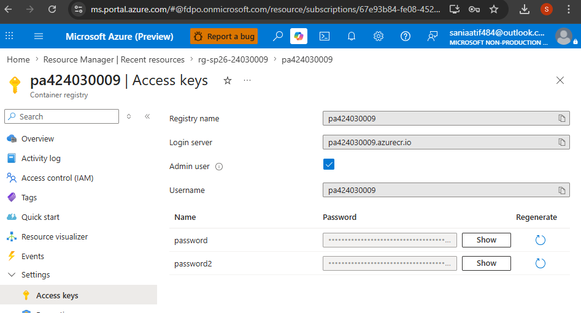

The ACR Admin user is enabled under Settings → Access keys, providing the username and password credentials needed to authenticate Docker and the AKS pull secret. Admin user must be enabled for the Function App and AKS to pull images using registry credentials.

### Evidence 2.3: Docker Builds

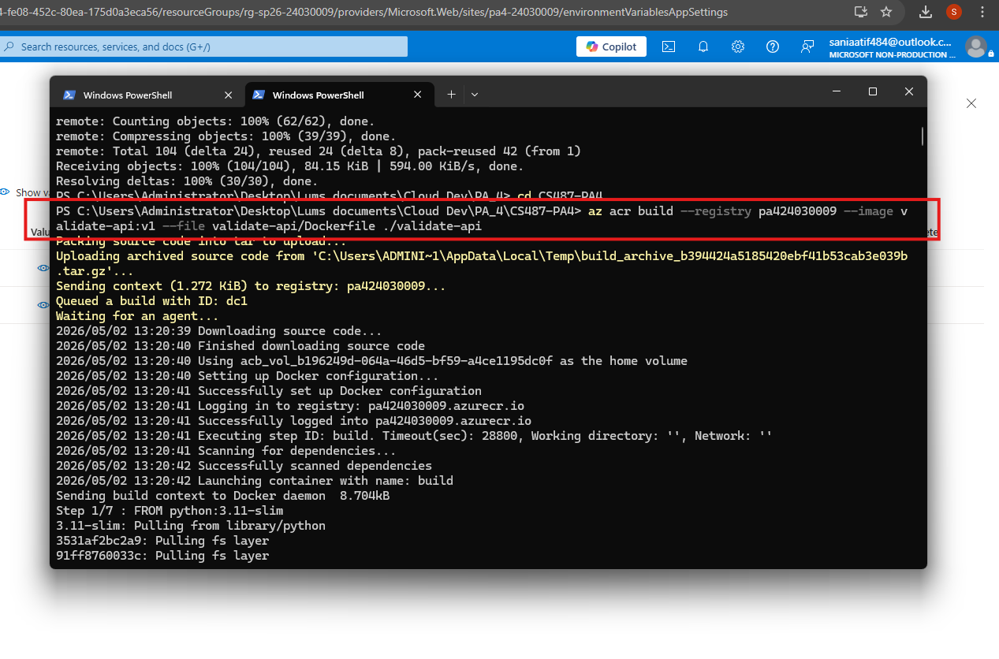

Successful local Docker build of the `validate-api` image from the `validate-api/` directory. The image is built using the FastAPI base and exposes `POST /validate` and `GET /health` on port 8080.

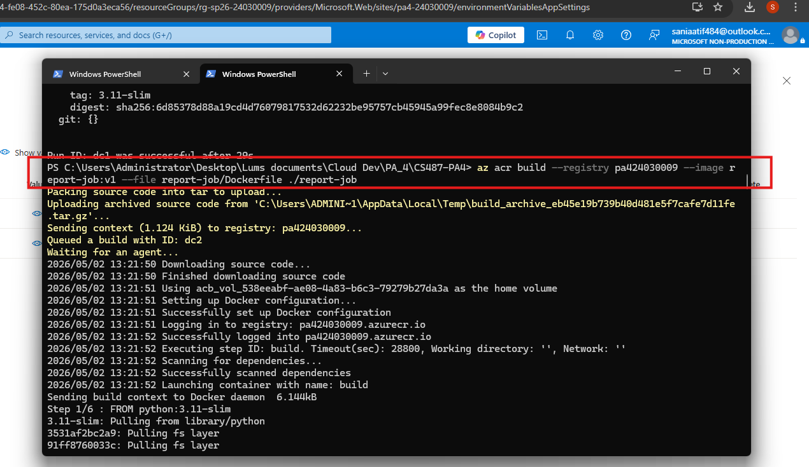

Successful Docker build of the `report-job` image from the `report-job/` directory. This is a one-shot container that reads environment variables, generates a PDF, writes it to blob storage, and exits.

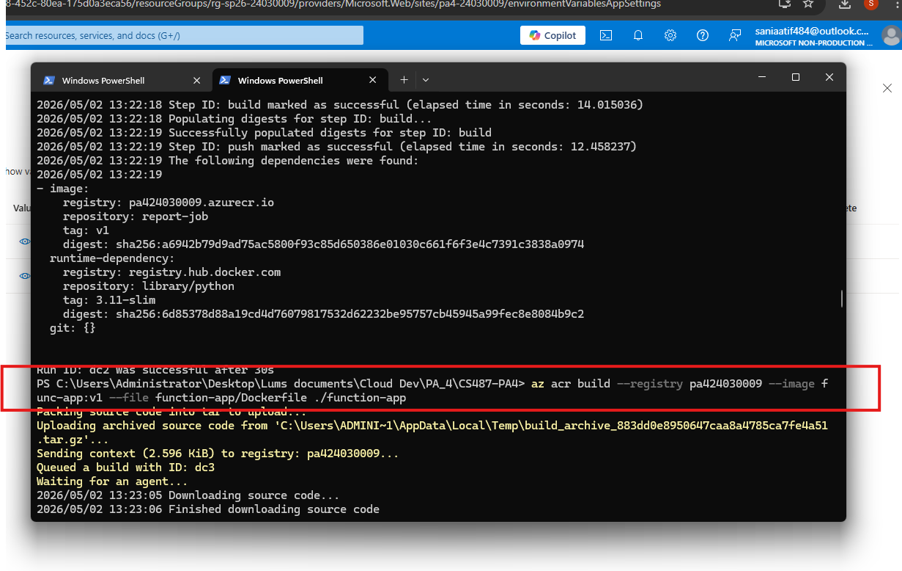

Successful Docker build of the `func-app` image from the `function-app/` directory using the `mcr.microsoft.com/azure-functions/python:4-python3.11` base image.

### Evidence 2.4: Local Validator Test

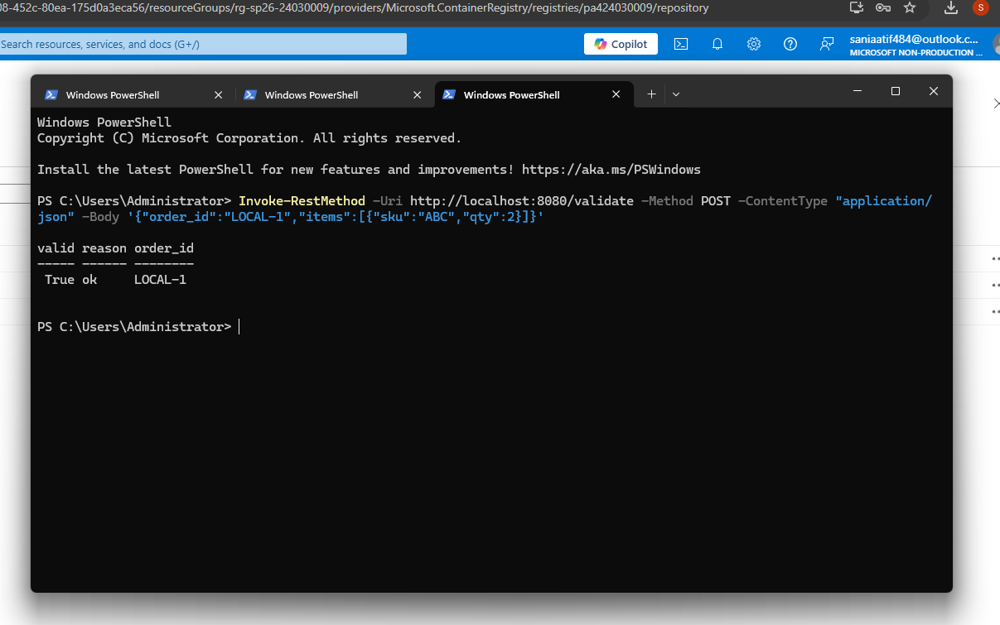

The validator container was tested locally with a `POST /validate` request returning a valid JSON response `{"valid": true, "reason": "ok"}`, confirming the FastAPI service is correctly implemented.

### Evidence 2.5: ACR Pushes and Repository List

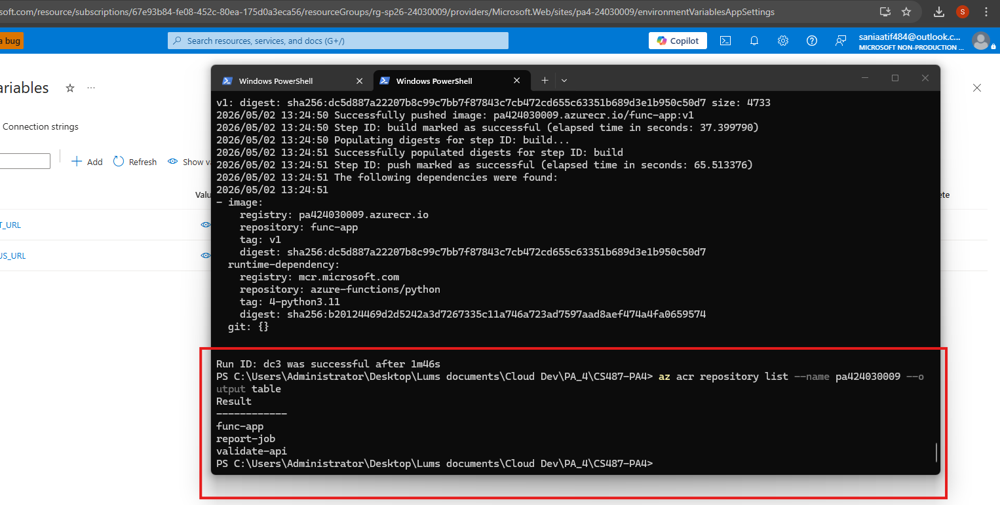

All three images were successfully tagged and pushed to `pa424030009.azurecr.io`. The push output confirms layers uploaded and digests verified for each image.

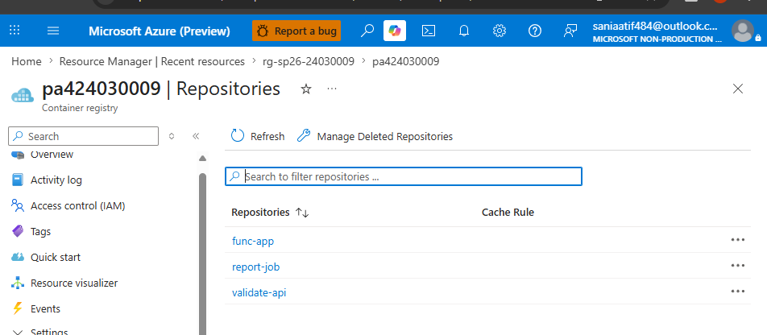

The ACR repository list shows all three repositories: `validate-api`, `report-job`, and `func-app`, each tagged `:v1`, confirming all images are available for deployment.

---

## Task 3: Durable Function Implementation (12 points)

### Evidence 3.1: Completed Function Code

The completed orchestrator is in [`function-app/function_app.py`](function-app/function_app.py). The orchestrator receives an order payload, calls `validate_activity` which POSTs to the AKS validator, and if valid calls `report_activity` which uses the Azure Container Instance SDK to spin up the report job container. If validation fails, the orchestrator returns `{status: rejected}` immediately without creating an ACI.

### Evidence 3.2: Local Function Handler Listing

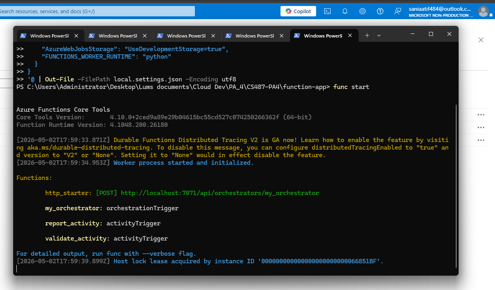

Running `func start` locally shows all four Durable Function handlers registered: `http_starter` (HTTP trigger), `my_orchestrator` (orchestration trigger), `validate_activity` (activity trigger), and `report_activity` (activity trigger). This confirms the Durable Functions runtime discovered all handlers correctly.

---

## Task 4: Function App Container Deployment (8 points)

### Evidence 4.1: Function App Container Configuration

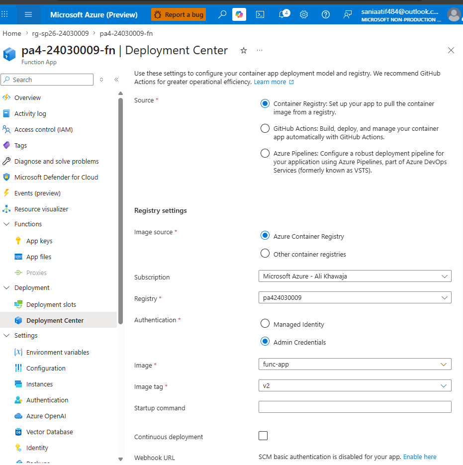

The Function App `pa4-24030009-fn` is configured to run the container image `pa424030009.azurecr.io/func-app:v2` pulled from the ACR registry. The Linux FX Version is set to `DOCKER|pa424030009.azurecr.io/func-app:v2`.

### Evidence 4.2: Functions List in Portal

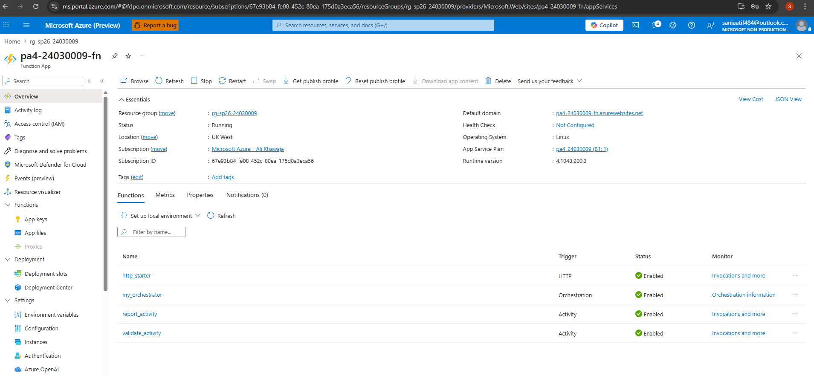

The Azure Portal shows all four functions registered under the Function App: `http_starter`, `my_orchestrator`, `validate_activity`, and `report_activity`, confirming the container image deployed and the Durable Functions host discovered all handlers.

### Evidence 4.3: Orchestration Smoke Test

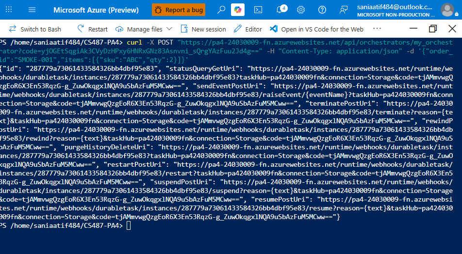

A `curl POST` to the HTTP starter endpoint returns a JSON response containing an `id` (instance ID) and `statusQueryGetUri`. This proves the Function App container is running and the Durable Functions HTTP starter accepted the request and began an orchestration.

### Evidence 4.4: Expected Failed Status Before Downstream Wiring

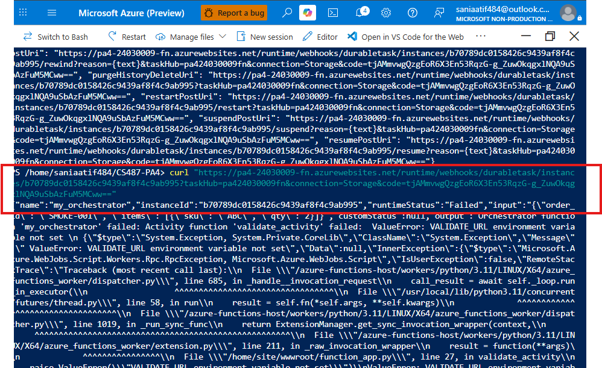

Polling the `statusQueryGetUri` shows `runtimeStatus: Failed` with an error about `VALIDATE_URL` not being set. This is the expected outcome at this stage — it proves the orchestration started and the activity ran far enough to attempt the HTTP call, but the AKS validator has not yet been deployed.

---

## Task 5: AKS Validator (15 points)

### Evidence 5.1: Kubernetes Nodes

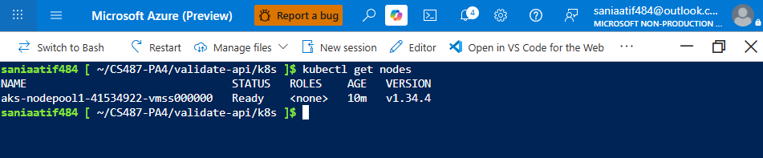

The AKS cluster `pa4-24030009` in resource group `rg-sp26-24030009` has one node of size `Standard_B2s` in UK West, showing status `Ready`. The cluster was created with `--node-count 1` as specified.

### Evidence 5.2: Validator Pod Running

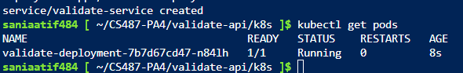

The `validate-deployment` pod is in `Running` state with 1/1 containers ready and 0 restarts, confirming the validator container pulled from ACR successfully and is serving requests.

### Evidence 5.3: Kubernetes Service External IP

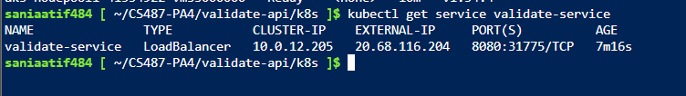

The `validate-service` LoadBalancer service has been assigned external IP `20.68.116.204` on port `8080`, provisioned by Azure as a public load balancer. This IP is used by the Function App to reach the validator.

### Evidence 5.4: Validator API Tests

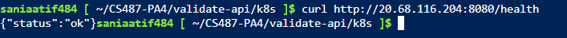

The `GET /health` endpoint returns `{"status":"ok"}`, confirming the FastAPI application started and is healthy.

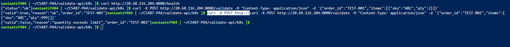

A valid order (`qty: 2`) returns `{"valid": true, "reason": "ok"}`. An invalid order (`qty: 999`) returns `{"valid": false, "reason": "quantity exceeds limit"}`, demonstrating the validation rule of `qty > 100` is enforced correctly.

### Evidence 5.5: VALIDATE_URL Application Setting

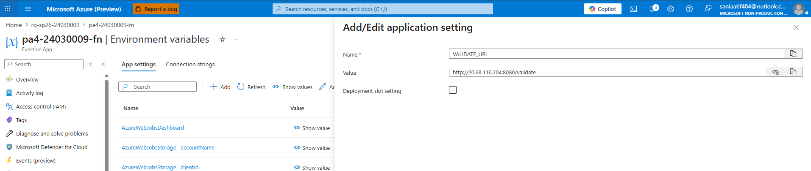

The Function App application setting `VALIDATE_URL` is set to `http://20.68.116.204:8080/validate`, pointing to the AKS LoadBalancer external IP. The `validate_activity` reads this environment variable at runtime to reach the validator.

### Evidence 5.6: AKS Idle Behavior

After periods of no order submissions, the `validate-deployment` pod remains in `Running` state with `1/1` containers ready and `0` restarts — the AKS node keeps billing continuously regardless of traffic. Unlike ACI which only exists while work is being done, AKS maintains its node and pod permanently. This is the correct operational model for the validator because it must respond instantly to every order without a cold-start delay, but it means the `Standard_B2s` node incurs cost 24/7. This idle-cost tradeoff is exactly why the report generator uses ACI instead — a batch job that runs for 20 seconds per order would be wasteful as a permanent AKS workload.

---

## Task 6: ACI Report Job (15 points)

### Evidence 6.1: Reports Blob Container

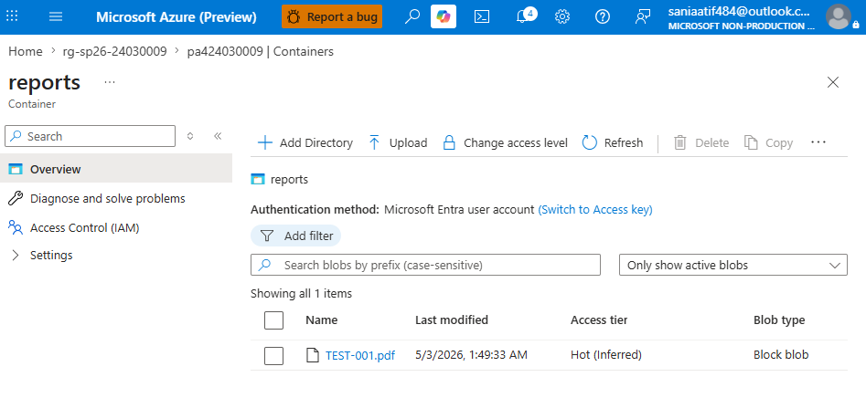

The `reports` blob container was created in storage account `pa424030009` using `az storage container create`. This is the destination where the report-job container writes generated PDF files.

### Evidence 6.2: Manual ACI Run — State Succeeded

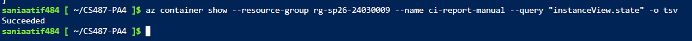

The manually created test container `ci-report-test` transitioned to `Succeeded` state, confirming the report-job container ran to completion, generated the PDF, and uploaded it to blob storage before exiting cleanly.

### Evidence 6.3: ACI Logs

The container logs show the report-job's own output including PDF generation and the blob upload confirmation. The container exits after writing the file, demonstrating the one-shot ACI lifecycle pattern.

### Evidence 6.4: Generated PDF in Blob Storage

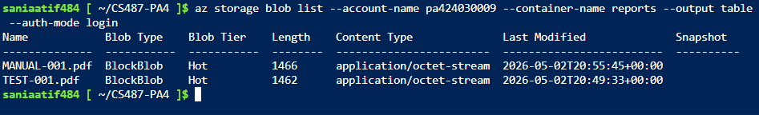

The `az storage blob list` output confirms `TEST-001.pdf` is present in the `reports` container, proving the ACI successfully wrote the PDF to blob storage using the managed identity.

### Evidence 6.5: Managed Identity Attached

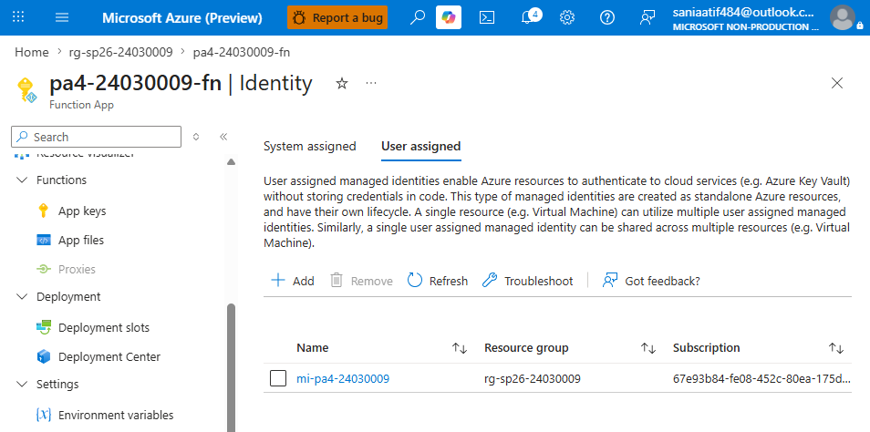

The Function App's Identity blade shows the user-assigned identity `mi-pa4-24030009` attached under the User Assigned tab. This identity is used by `report_activity` via `DefaultAzureCredential` to authenticate to Azure when creating ACIs and writing to storage — no secrets stored in code.

### Evidence 6.6: Function App Report Settings

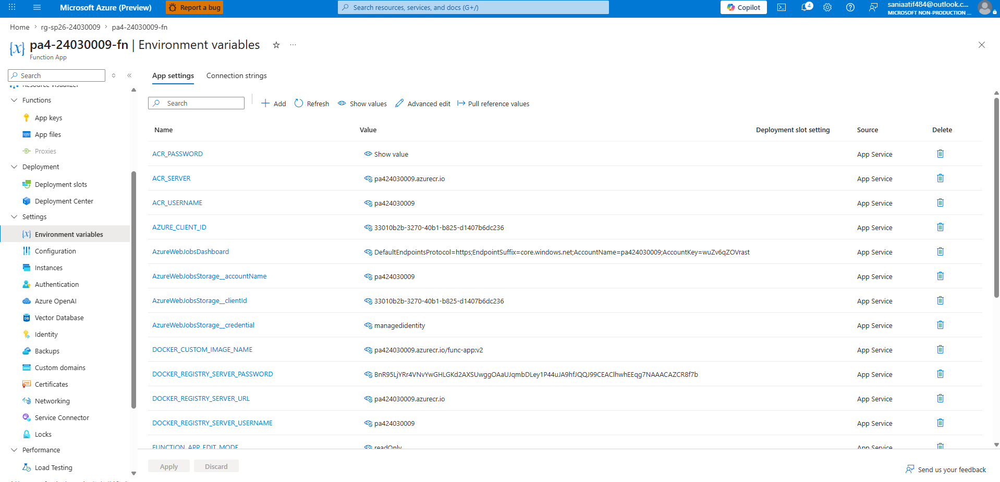

The Function App application settings include `REPORT_IMAGE`, `ACR_SERVER`, `ACR_USERNAME`, `STORAGE_ACCOUNT_URL`, `REPORT_RG`, `REPORT_LOCATION`, and `SUBSCRIPTION_ID` — all required by `report_activity` to create the ACI with the correct image and environment. Secrets are masked.

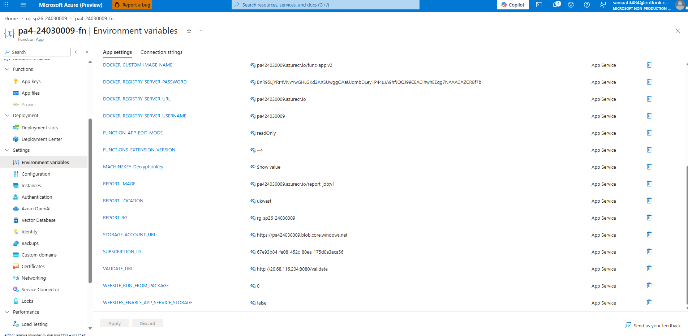

Additional settings include `AZURE_CLIENT_ID` (the managed identity client ID used by `DefaultAzureCredential`) and the `AzureWebJobsStorage__*` identity-based storage settings required by the Durable Functions runtime.

---

## Task 7: End-to-End Pipeline (15 points)

### Evidence 7.1: Happy Path — Form Before Submit

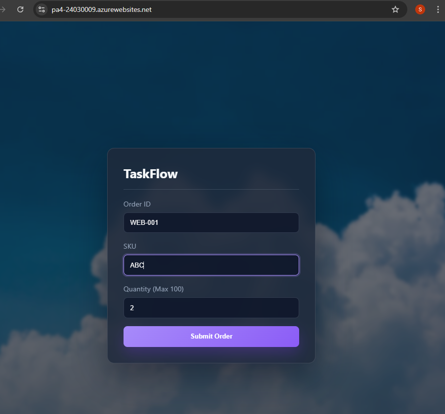

The TaskFlow web UI at `https://pa4-24030009.azurewebsites.net` is loaded with Order ID `WEB-001`, SKU `ABC`, and Quantity `2` filled in — a valid order that will pass the validator's `qty ≤ 100` check.

### Evidence 7.2: Happy Path — Running Status

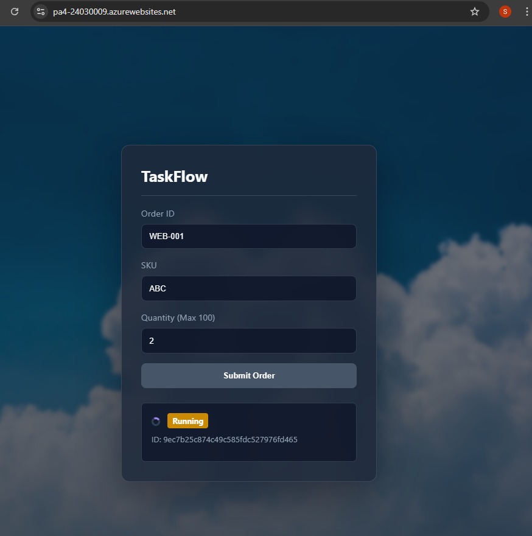

Immediately after clicking Submit, the status panel updates to `Running` and displays the live orchestration instance ID `9ec7b25c874c49c585fdc527976fd465`. This confirms the Web App successfully called the Function App HTTP starter and the Durable orchestration began.

### Evidence 7.3: Happy Path — Completed Status

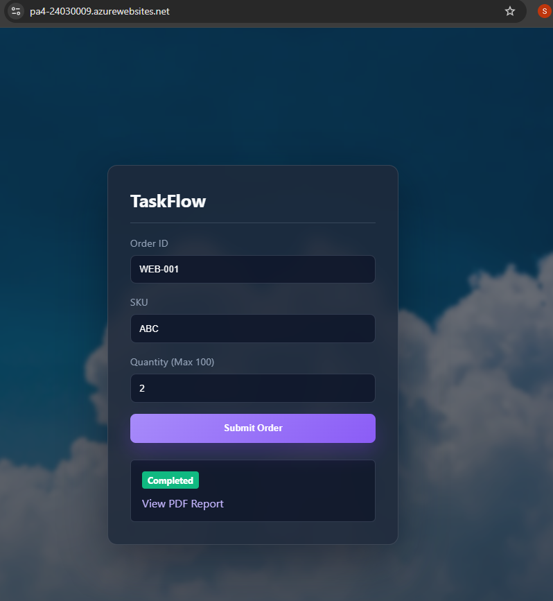

The status panel updates to `Completed` and displays a `View PDF Report` link, confirming the full pipeline ran: the orchestrator called the validator (approved), spun up the ACI report job, and received the blob URL of the generated PDF.

### Evidence 7.4: Downloaded PDF

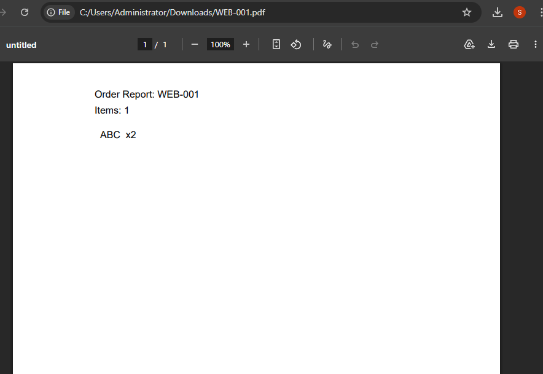

The generated PDF `WEB-001.pdf` is open in a browser PDF viewer showing "Order Report: WEB-001, Items: 1, ABC x2". This proves the report-job container correctly processed the order payload and generated a valid PDF that was written to blob storage.

### Evidence 7.5: CLI Runtime Status Running

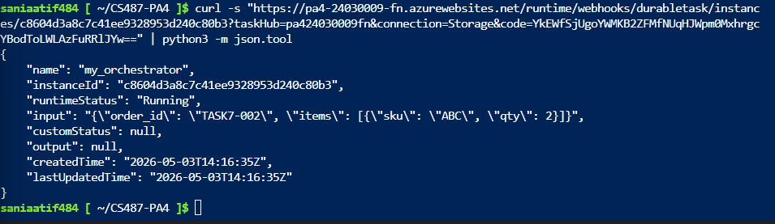

The `statusQueryGetUri` polled via curl returns `runtimeStatus: Running` for instance `c8604d3a8c7c41ee9328953d240c80b3`, providing CLI-level evidence that the orchestration was active and processing.

### Evidence 7.6: Function App Monitor — Invocations

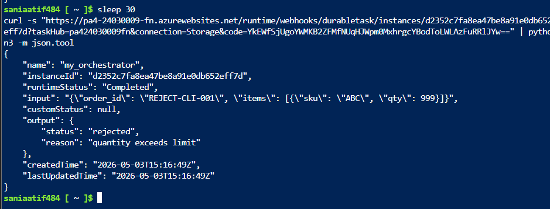

The Function App Monitor invocations tab shows orchestration runs including the rejection path completing with `status: rejected, reason: quantity exceeds limit`. This confirms both the orchestrator and the `validate_activity` function executed and the rejection branch was taken correctly.

### Evidence 7.7: ACI Spawned During Run

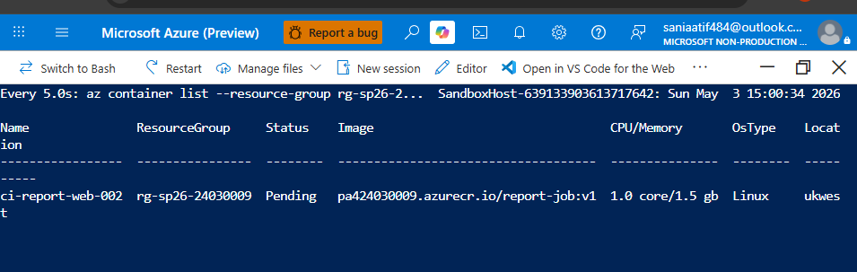

During a happy-path run, `az container list` shows `ci-report-web-002` in `Pending` state with image `pa424030009.azurecr.io/report-job:v1` in resource group `rg-sp26-24030009`. The ACI is auto-deleted by `report_activity` after the PDF is written, confirming the ephemeral per-run pattern.

### Evidence 7.8: Blob Storage with Generated PDF

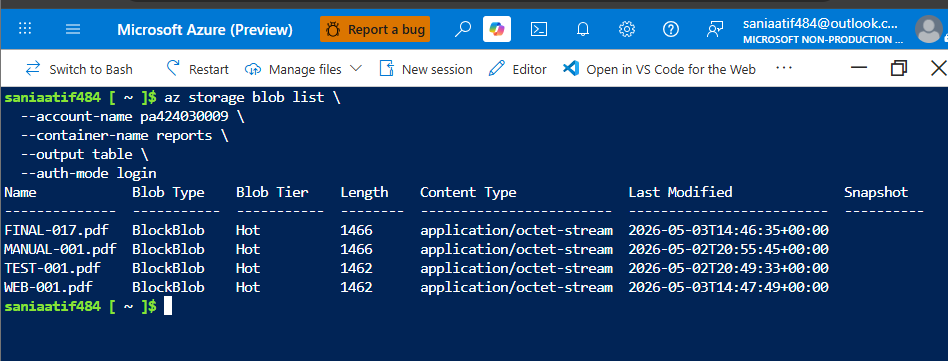

The `az storage blob list` output shows `WEB-001.pdf` in the `reports` container alongside other test PDFs, with a last-modified timestamp matching the happy-path run. This traces the same order ID from form submission through to the final artifact.

### Evidence 7.9: AKS Validator Received Traffic

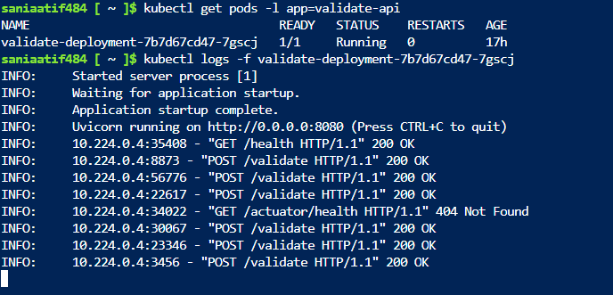

The `kubectl logs` output for the `validate-deployment` pod shows multiple `POST /validate HTTP/1.1 200 OK` entries, confirming the AKS validator received and processed requests from the Function App's `validate_activity` during the pipeline runs.

### Evidence 7.10: Rejection Path UI

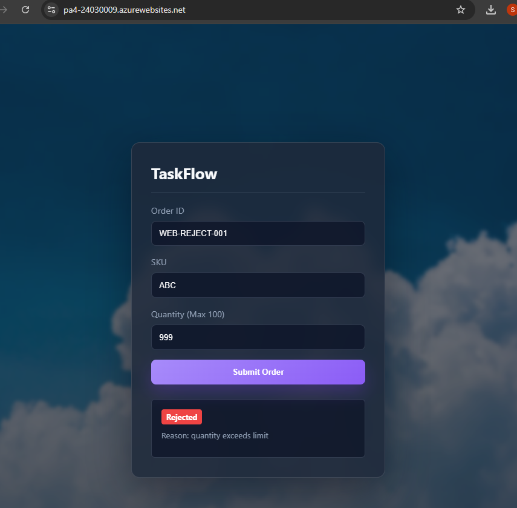

Submitting an order with Order ID `WEB-REJECT-001` and Quantity `999` shows a `Rejected` status with reason "quantity exceeds limit". The validator correctly rejected the order because `qty > 100`, and the orchestrator short-circuited without creating an ACI.

### Evidence 7.11: No ACI for Rejected Order

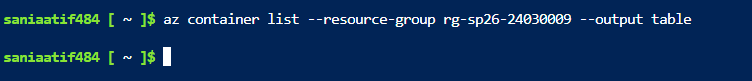

After the rejected order, `az container list` returns empty, confirming that no Container Instance was spawned. This proves the orchestrator's conditional branch correctly skipped `report_activity` when validation returned `valid: false`.

### Evidence 7.12: Resource Group Overview

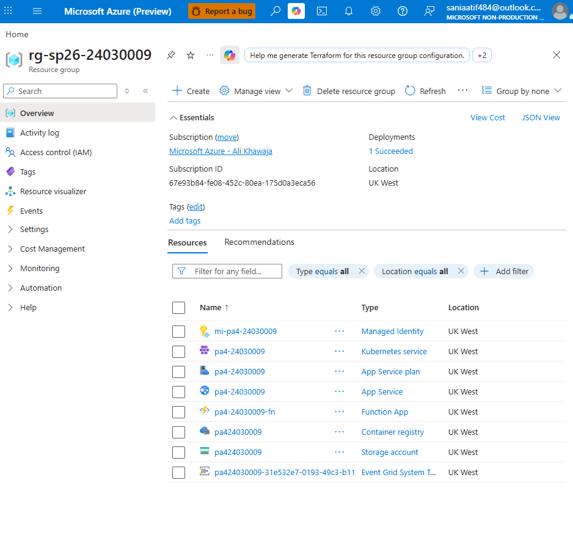

The resource group `rg-sp26-24030009` in UK West shows all deployed resources: App Service Plan (`pa4-24030009`), App Service (`pa4-24030009`), Function App (`pa4-24030009-fn`), Container Registry (`pa424030009`), Storage Account (`pa424030009`), Kubernetes Service (`pa4-24030009`), and Managed Identity (`mi-pa4-24030009`).

---

## Task 8: Write-up and Architecture Diagram (5 points)

### Evidence 8.1: Architecture Diagram

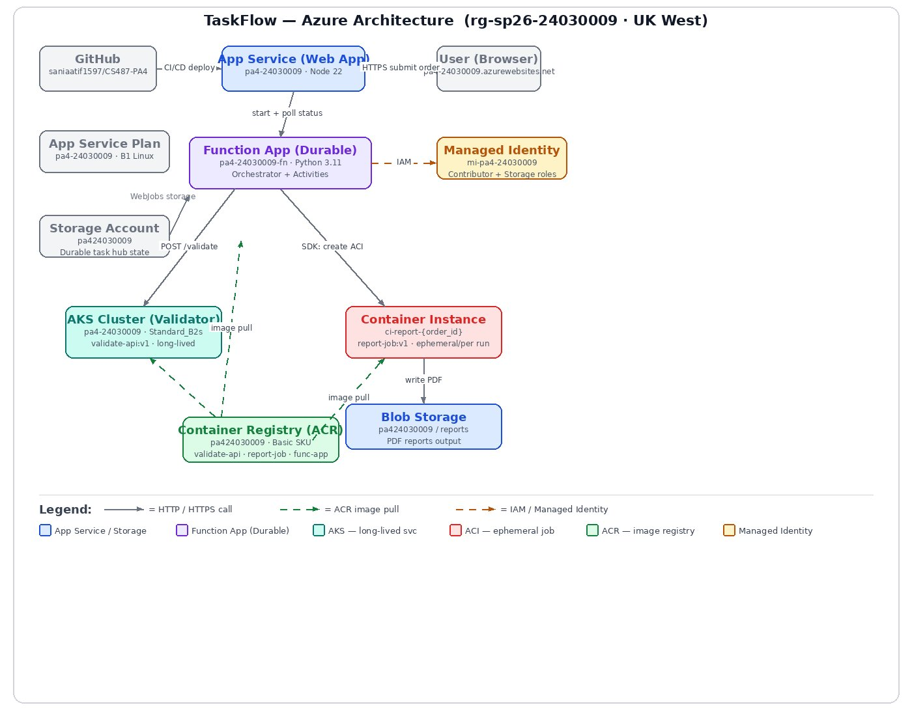

The diagram shows all Azure resources in `rg-sp26-24030009`: GitHub CI/CD to App Service, Web App to Function App (start + status polling), Function App to AKS (POST /validate), Function App to ACI via SDK (ephemeral per run), ACI to Blob Storage (PDF write), ACR providing images to Function App, AKS, and ACI, and the Managed Identity IAM relationship.

### Question 8.2: Service Selection

**App Service** is the right choice for the TaskFlow web frontend because it provides a fully managed PaaS platform with built-in GitHub Actions CI/CD, HTTPS termination, and persistent long-running hosting. The web UI has no idle periods — it must always be available to accept user submissions — which makes a consumption model inappropriate. App Service B1 keeps costs fixed and predictable for this always-on workload.

**Durable Functions** is the right choice for the orchestration layer because the pipeline is multi-step and stateful: it must call the validator, wait for the result, conditionally spawn the ACI, and wait for the ACI to complete before returning the report URL. This entire flow can take up to 60 seconds. Plain HTTP functions have a timeout ceiling and cannot persist state between steps — if the host restarts mid-flight, the whole run is lost. Durable Functions checkpoints state between each `yield`, so if the runtime replays the orchestrator after a failure, completed activities are not re-executed.

**Azure Kubernetes Service** is the right choice for the validator microservice because it is a long-lived HTTP service that must be continuously available to accept validation requests during every order. AKS provides a stable, always-running endpoint with a LoadBalancer IP, declarative deployment manifests, and pod-level restarts on failure. While Container Apps would be simpler, AKS represents the industry standard for enterprise microservice orchestration and demonstrates production-grade Kubernetes skills.

**Azure Container Instances** is the right choice for the report generator because it is a short-lived batch task that starts, does its work, and exits. ACI bills only while the container is alive — a report that takes 20 seconds costs fractions of a cent. Keeping this as a perpetually-running Kubernetes workload would waste compute and money for a task that runs once per order. The Durable orchestrator creates the ACI via SDK, waits for `Succeeded`, cleans it up, and returns the blob URL — the ephemeral lifecycle is built into the design.

### Question 8.3: ACI vs AKS

**AKS idle behavior:** The AKS node (`Standard_B2s`) continues running and billing even when no orders are being processed. The validator pod stays alive with 1/1 containers ready, consuming node compute continuously. After 10 minutes of idle the pod remains running — AKS has no scale-to-zero on Standard nodes. This means AKS incurs cost 24/7 regardless of traffic.

**ACI idle behavior:** ACI has no concept of idle in this pipeline — each Container Instance exists only for the duration of one report run (typically 15-30 seconds), then is deleted by `report_activity`. There is no persistent ACI sitting idle between orders. The cost is purely per-second while running.

**Cost under spam:** If a malicious user spammed the Submit button 1000 times in a minute, AKS would incur the most additional cost because each of those 1000 requests hits the validator pod — but the node was already running, so the marginal cost is near zero. The ACI side would be dramatically more expensive: `report_activity` would attempt to create 1000 Container Instances, each billed for at least 60 seconds of 1 vCPU / 1.5 GiB. At Azure ACI pricing that would be roughly 1000 × (1 vCPU-min + 1.5 GiB-min) which could easily exceed $5-10 in a single minute. This is why the orchestrator's validator gate is critical — rejected orders never reach `report_activity`.

**You cannot cleanly swap AKS and ACI** because AKS exposes a stable DNS/IP endpoint that the Function App calls synchronously, while ACI has no persistent endpoint — it is created per-run and deleted immediately. An ACI cannot serve as a long-lived HTTP microservice.

### Question 8.4: Durable Functions vs Plain HTTP

**Problem 1 — State persistence across steps:** The report pipeline calls validate, waits up to 60 seconds for the ACI to complete, and then returns a blob URL. A plain HTTP function would need to hold the HTTP connection open for the entire duration or pass state between two separate functions via an external store (database, queue). If the host restarts mid-flight, all in-memory state is lost and the order is silently dropped. Durable Functions serializes the orchestration state to the storage task hub after every `yield`, so a host restart simply replays the orchestrator from the last checkpoint — without re-executing completed activities.

**Problem 2 — Chained retries and error isolation:** With two plain HTTP functions calling each other, a transient failure in the second function (the ACI creation) would require the caller to implement its own retry logic, and a failure in the first function would leave no record of what happened. Durable Functions provides built-in retry policies per activity, and the orchestration history in the task hub records every input, output, and failure with timestamps — visible in the Function App Monitor. This makes debugging the `validate_activity → report_activity` chain straightforward compared to reconstructing what happened across two independent function invocations.

### Question 8.5: Cost Review

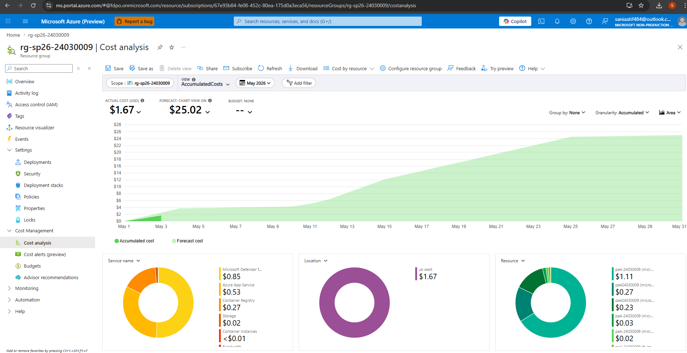

The single most expensive resource is the AKS cluster node (`Standard_B2s`), which bills continuously at approximately $0.048/hour regardless of whether any orders are being processed. Over a one-week deployment the node alone accounts for the majority of the resource group's spend. The Function App and App Service share the same B1 App Service Plan so they add no incremental compute cost. Storage and ACR contribute negligible amounts at the Basic tier.

### Question 8.6: Challenges Faced

**Challenge 1 — Storage key-based authentication blocked by Azure Policy:** The instructor's subscription enforces an Azure Policy that disables key-based authentication on all storage accounts. The Function App kept failing with `KeyBasedAuthenticationNotPermitted` on startup because the Durable Functions runtime was trying to connect to its task hub storage using a connection string. The fix required switching from `AzureWebJobsStorage` (connection string) to the three `AzureWebJobsStorage__accountName / __credential / __clientId` split settings, which instruct the runtime to use the managed identity instead of a key. After removing the legacy `AzureWebJobsDashboard` setting (which also used key auth) and adding `AzureWebJobsSecretStorageType=files` to avoid blob-based key storage, the host finally started successfully.

**Challenge 2 — AKS kubectl credentials expiring mid-session:** During Task 7 end-to-end testing, kubectl started returning "the server has asked for the client to provide credentials" errors, which also caused the validator pod to become unreachable. The root cause was that the Azure AD token embedded in the kubeconfig had expired after several hours of work. Running `az aks get-credentials --overwrite-existing` refreshed the token and restored kubectl access. Separately, the AKS cluster itself had entered a degraded state where its API server DNS (`pa4-240300-rg-sp26-24030009-67e93b-0hg57ic5.hcp.ukwest.azmk8s.io`) became unresolvable, which was resolved by running `az aks start` to bring the cluster back to Running state and then re-fetching credentials.
